## **Demographic Analysis**

### **Age Distribution**

  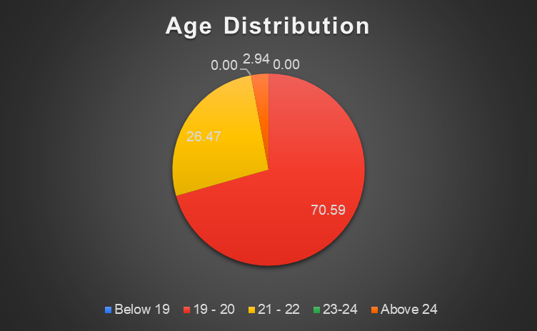

### **Level of Study**

  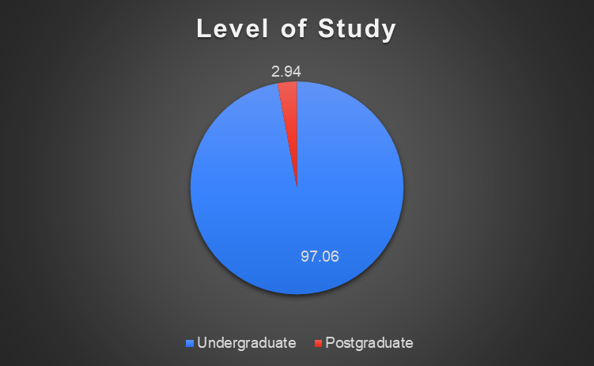

### **Year of Study**

  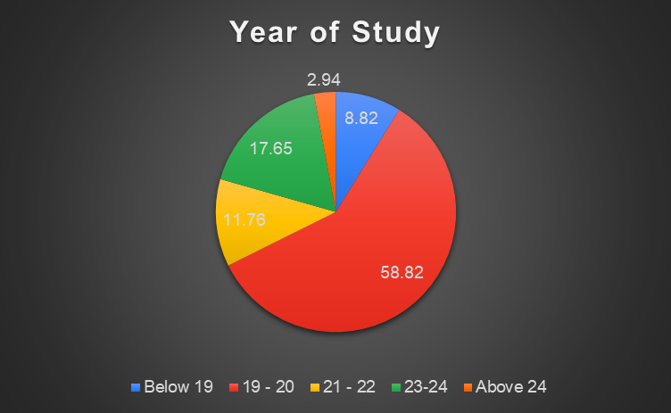

---

## **A) Knowledge and Awareness of Quantum Technology**

### **Numerical Analysis**

- **Self-rated knowledge of quantum science:** 
	- Mean = 1.91, Std = 0.57

- **Familiarity with Quantum 1.0 applications:** 
	- Mean = 1.64, Std = 0.73

- **Perceived significance of Quantum 1.0 in technology:**
	- Mean = 2.18, Std = 1.09

- **Familiarity with Quantum 2.0 applications:** 
	- Mean = 1.56, Std = 0.82

- **Perceived significance of Quantum 2.0 in future technology:** 
	- Mean = 2.47, Std = 1.19

### **Awareness and Exposure**

- **Have you heard of quantum technology (QT)?**

  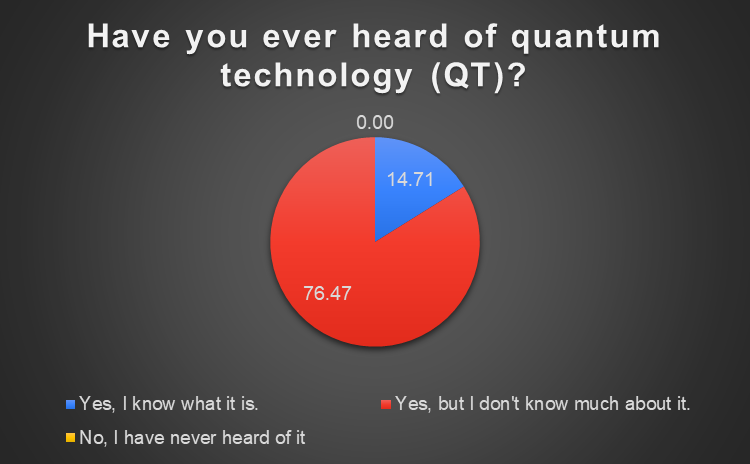

	
- **First exposure to QT:**

  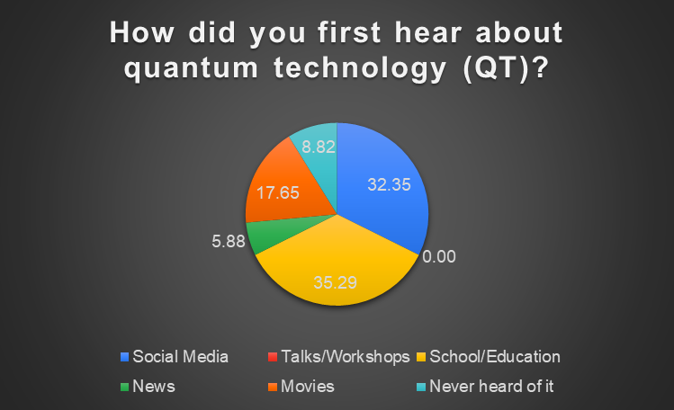

    
- **Awareness of the 1st Quantum Revolution (Quantum 1.0):**  
    

  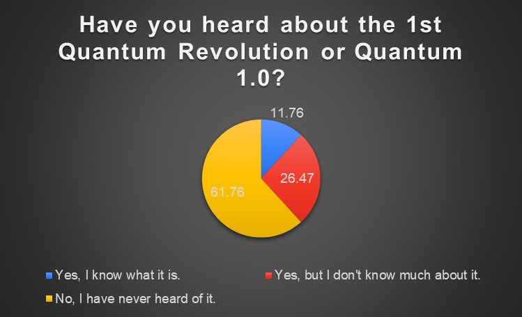

    
- **Awareness of the 2nd Quantum Revolution (Quantum 2.0):**  
    

  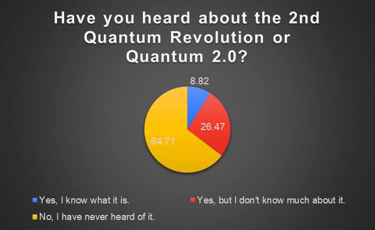

    
---

## **B) Perceptions of Quantum Technology (QT)**

### **Numerical Analysis**

- **Significance of QT compared to AI, nuclear technology, etc.:** 
	- Mean = 3.23, Std = 1.02

- **Importance of investing in QT within this decade:** 
	- Mean = 3.29, Std = 1.03

- **Overall interest in QT:** 
	- Mean = 2.79, Std = 0.98

- **Perceived long-term benefits of QT:** 
	- Mean = 3.97, Std = 0.77

- **Perceived potential threats of QT:** 
	- Mean = 3.26, Std = 0.99

### **Quantum Technology Impact Areas**

- **Fields where Quantum 2.0 is expected to have a significant impact:**  
    

  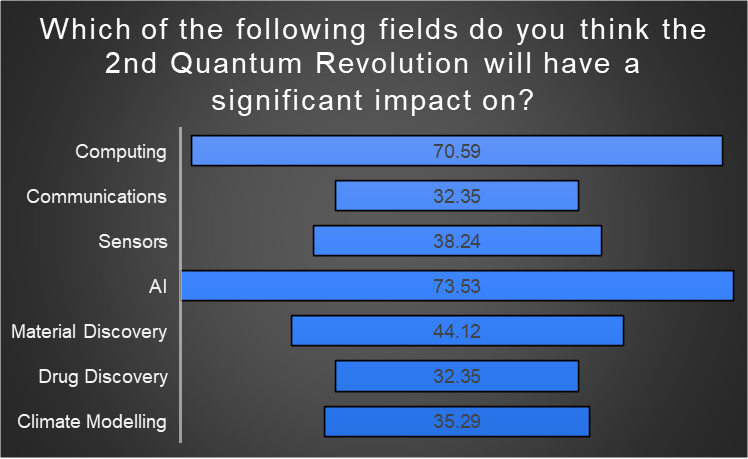

    
- **Most exciting field in QT:**  
    

  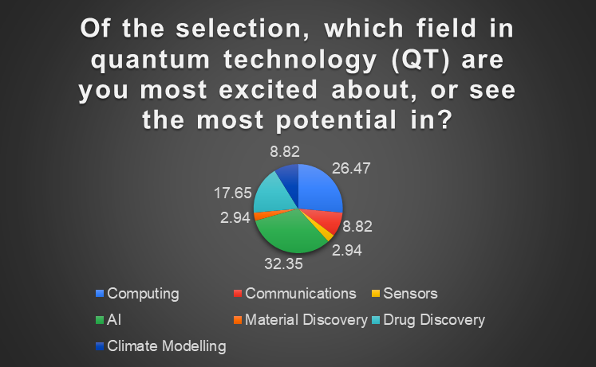

    
- **Expected timeline for widespread adoption of Quantum 2.0:**  
    

  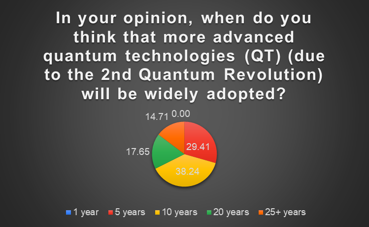

---

## **C) Quantum Technology and Malaysia**

### **Numerical Analysis**

- **Is it worthwhile for Malaysia to invest in QT?** 
	- Mean = 3.00, Std = 1.13

- **Is Malaysia ready for QT development?** 
	- Mean = 2.29, Std = 0.84

- **Effectiveness of university education in QT awareness:**
	- Mean = 2.24, Std = 0.92

- **Effectiveness of pre-university education in QT awareness:** 
	- Mean = 2.06, Std = 0.85

### **Quantum Initiatives in Malaysia**

- **Awareness of global quantum initiatives and start-ups:**  
    

  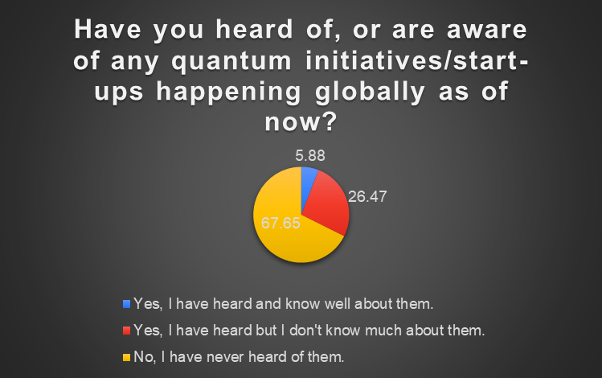

- **Awareness of local (Malaysia-based) quantum initiatives and start-ups:**  
    

  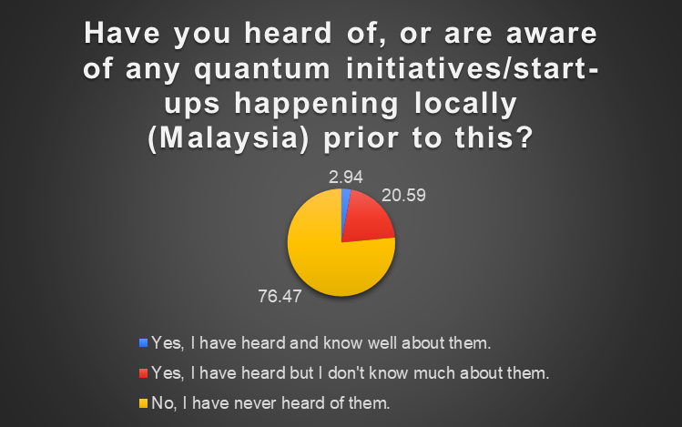

- **Key sector Malaysia needs to improve for QT adoption:**  
    

  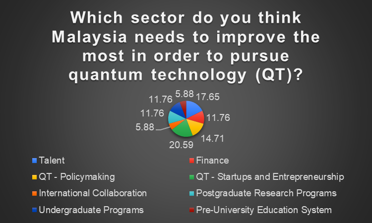

    
- **Best approach to increasing public awareness of quantum technology:**  
    

  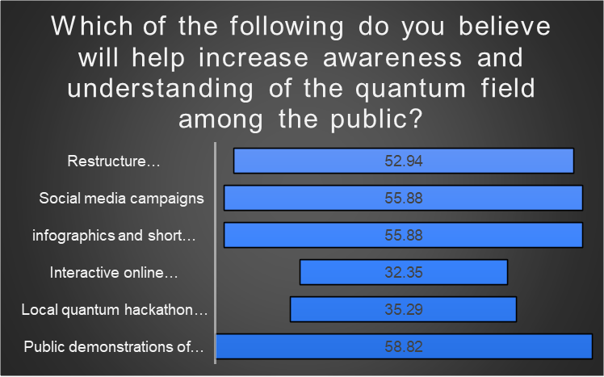

